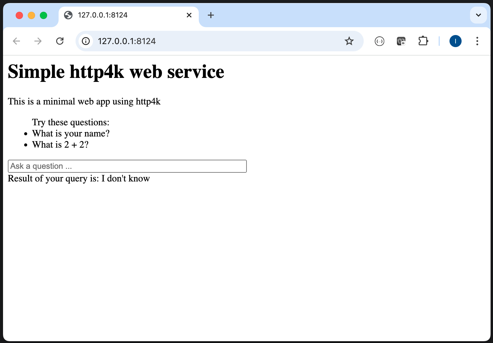

This is a simple web server written in kotlin, using [http4k](https://www.http4k.org/).

# Steps to get started

1. Login to https://github.com/
2. Fork this repo
3. Clone your fork on your machine:
    - ```git clone git@github.com:<your-username>/SimpleHttp4kServer.git```
4. Make sure you can build the service on your machine:
    - ```./gradlew build```
5. You can run the service on your machine:
    - ```./gradlew run```
    - open http://127.0.0.1:8124/
    - You should see:
        - 
6. <code style="color:red">Stop the server</code> by pressing ctrl-c in the terminal where you ran it from

## Deploying the service

For this lab we will use https://fly.io/

This is a commercial product - I have no affiliation with it, it’s just useful for the lab.

### Install the Fly.io CLI

First, check to see whether you have the "fly" CLI already installed.

If executing this:
```bash
flyctl
```
prints something like this (truncated here):
```
This is flyctl, the Fly.io command line interface.

Usage:
  flyctl [flags]
  flyctl [command]
...
```
then the "fly" CLI is already installed.

Otherwise:
```bash
brew install flyctl
```

### login to fly

For this you will need a username and password which I will give you.

1. Login to fly
```bash
fly auth login
```
2. Edit fly.toml so your service gets a unique URL (for example):
```bash
sed -i .back "s/simplehttp4kserver/simplehttp4kserver-$USER/g" fly.toml
```
3. commit and push this change
4. "Launch" the app to deploy it for the first time to Fly.io - you only have to do this once
```bash
fly launch
```
Answer the questions as below:
```
Would you like to copy its configuration to the new app? (y/N)
y

Do you want to tweak these settings before proceeding? (y/N)
n
```
If this has worked, you should see a message like:
```text
Visit your newly deployed app at https://simplehttp4kserver-ivan.fly.dev/
```
5. After having run "launch" once, you can do further deployments with "deploy" instead of "launch"
```bash
fly deploy
```
6. Open a browser on the URL of the deployed service
```bash
open "https://simplehttp4kserver-$USER.fly.dev/"
```
7. Set up GitHub Actions CD pipeline:
    - Generate a token for Fly.io
```bash
fly tokens create deploy -x 999999h
```
- Go to the GitHub “Settings” for your repository where you’ll find “Secrets and variables” and click on “Actions”
- In the “Repository Secrets” section, add “New repository secret” with name FLY_API_TOKEN and the value as just generated.
- Make sure your pipeline setup is working by making a change to the HTML in the class HomePage and seeing that it changes in the deployed service.
8. Copy or move the pre-prepared GitHub actions file ".github/workflows/fly-deploy.yml" to ".github/workflows/fly-deploy.yml"
```bash
mkdir -p .github/workflows
git mv fly-deploy.yml .github/workflows/fly-deploy.yml
```
9. Commit and push
10. Make a change to HomePage and commit and push
11. Look in GitHub "Actions" tab for your repository
12. You should see your GitHub action running
13. Once this has finished, you should see that your changes have been deployed to your running service

# Troubleshooting

### debug running app

```bash
fly logs
```

## Docker

Fly.io builds and runs your service as a Docker container.
You can replicate what it is doing on your machine if you have Docker installed.

1. build docker image
```bash
docker build -t SimpleHttp4kServer .
```
2. run docker container based on that image
```bash
docker run -p 8124:8124 --name SimpleHttp4kServer SimpleHttp4kServer
```
3. See it running: http://localhost:8124/
4. run docker container based on that image
```bash
docker rm -f SimpleHttp4kServer
```
5. cleanup
```bash
docker container prune -f
```
